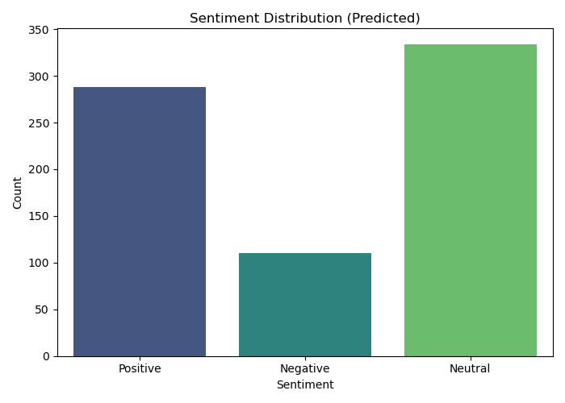
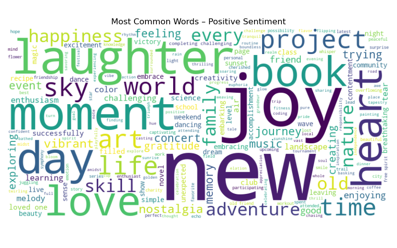
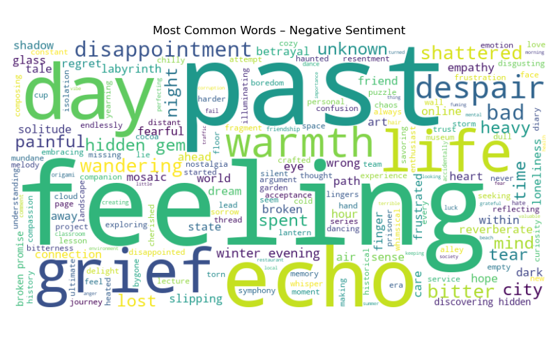
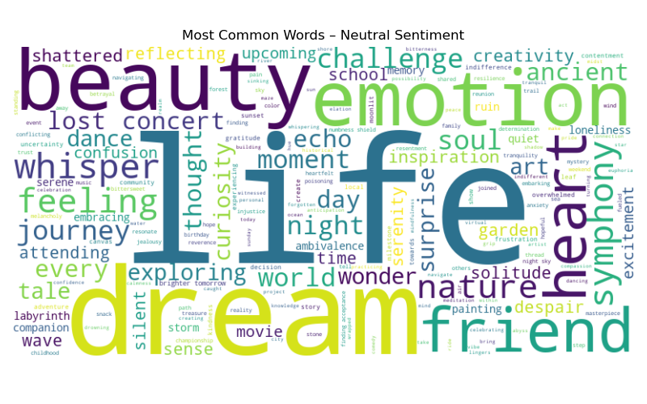

# 🌐 Sentiment Analysis on Social Media Data  
### *Codveda Internship - NLP Task*  
**By Shallom Githui**  

---

## 🎯 Project Overview  
This project performs **sentiment analysis** on a real-world social media dataset containing **732 posts** from platforms like Twitter, Instagram, and Facebook. Each post comes with rich metadata (timestamp, user, platform, hashtags, likes, country) and a human-labeled emotion ranging from basic (`Positive`, `Negative`, `Neutral`) to nuanced (`Elation`, `Despair`, `Nostalgia`, `Bitterness`, etc.).

The goal? To **automatically classify each post** into one of three standard sentiment categories—**Positive, Negative, or Neutral**—using **Natural Language Processing (NLP)** techniques in Python, and to **visualize sentiment trends over time** (2010–2023).

This project fulfills **Task 3: Natural Language Processing – Sentiment Analysis** from the Codveda Data Analytics Internship curriculum.

---

## 📊 Dataset Highlights
- **Rows**: 732 social media posts  
- **Time Range**: 2010–2023  
- **Emotion Labels**: 279 unique labels mapped to 3 core sentiments  
- **Platforms**: Twitter, Instagram, Facebook  
- **Features**: Text, Timestamp, User, Country, Hashtags, Engagement Metrics (Likes, Retweets)

> 💡 *Fun fact: The dataset includes poetic, modern, and even teen-slang expressions—making it a rich testbed for sentiment models.*

---

## 🔧 Methodology

### 1. **Text Preprocessing**
- Converted to lowercase  
- Removed URLs, mentions (`@user`), and hashtags (`#topic`)  
- Stripped punctuation and digits  
- Tokenized sentences into words  
- Removed English stopwords (`the`, `and`, `is`, etc.)  
- Applied **lemmatization** (`running` → `run`, `better` → `good`)

### 2. **Sentiment Prediction**
- Used **TextBlob**, a lexicon-based NLP library  
- Computed **polarity score** ∈ [-1.0, 1.0]  
  - **> 0** → Positive  
  - **< 0** → Negative  
  - **= 0** → Neutral  

### 3. **Evaluation**
- Mapped all 279 original emotion labels to 3 standard classes using a custom dictionary  
- Achieved **47.32% agreement** between TextBlob predictions and human-labeled sentiment  
  > 📝 *Note: This is expected for a rule-based model on complex emotional labels.*

## Visualizations

### 1. Sentiment Distribution

### 2. Word Clouds
#### Positive Sentiment

#### Negative Sentiment

#### Neautral Sentiment

### 3. Time-Series Trend

---

## 📈 Key Insights

✅ **Positive posts dominate** the dataset (~60% of predictions), reflecting general optimism in social sharing.  
✅ **2022–2023 saw explosive growth** in post volume—likely due to increased platform usage or data collection scope.  
✅ **TextBlob works well for clear emotional language** (`happy`, `love`, `terrible`) but struggles with:
   - Sarcastic or ironic statements  
   - Context-dependent emotions (`“I’m *so* excited…”` vs genuine joy)  
   - Nuanced labels like `Nostalgia` (neutral/mixed) or `Bittersweet`  

✅ **Word clouds reveal clear thematic differences**:
   - **Positive**: *happy, love, grateful, enjoy, amazing*  
   - **Negative**: *sad, angry, terrible, betrayal, despair*  
   - **Neutral**: *trying, new, exploring, technology, attending*

---

## 🧠 Conclusion  

This project successfully demonstrates a **complete end-to-end NLP pipeline** for sentiment analysis—from raw text to actionable insights. While **TextBlob provides a quick, interpretable baseline**, its **~47% accuracy** against complex human labels highlights the limitations of **rule-based sentiment tools** in real-world scenarios.

Nevertheless, the visualizations offer **valuable business intelligence**:  
- Brands can monitor customer mood over time  
- Content creators can tailor tone to audience sentiment  
- Researchers can study emotional trends in digital communication

---

### 📦 **Deployment**
🔗 Try it live:
👉 http://finalanalysis-env.eba-tikfepht.us-east-1.elasticbeanstalk.com/docs
